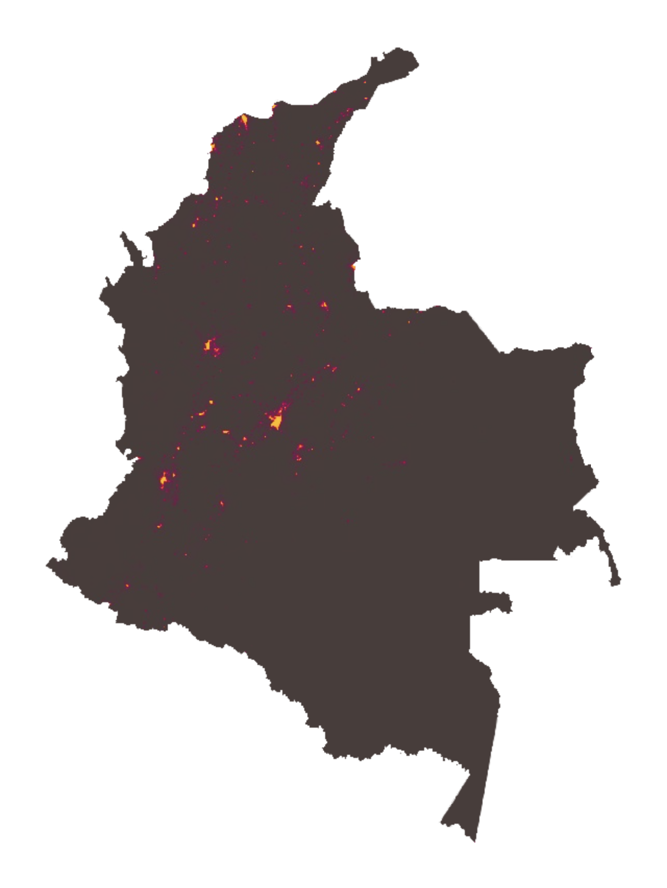

# Night-time reflectance in Colombia


This repository contains the code and data used for the analysis of night-time reflectance in Colombia. The analysis was performed using [Google Earth Engine](https://earthengine.google.com/) (GEE) and Python. In order to reproduce the results, you will need to have access to a Google Earth Engine service account and your own API key. See the [prerequisites](#prerequisites).

The repository is structured as follows:

```bash
├── earthengineapikey.json (private)
├── requirements.txt
├── LICENSE
├── README.md
├── data/
│   ├── inputs/
│   │   └── municipios_sel.csv
│   ├── outputs/
│   │   ├── areaskm2_municipios.csv
│   │   ├── cabeceras_stats_clean_2.csv
│   │   ├── mun_nocabeceras_stats_clean_2.csv
│   │   └── mun_stats_clean_2.csv
└── src/
    ├── ee_viirs/
    │   ├── 1_zonal_stats_cabeceras.py
    │   ├── 1_zonal_stats_mun.py
    │   ├── 1_zonal_stats_no_cabeceras.py
    │   └── 2_data_cleaning.py
    ├── 00_polygon_diff.py
    ├── 01_filtering.py
    ├── 02_asset_upload_gee.py
    └── 03_geom_diff.py

```

## Overview

The main aim of the analysis was to answer the following question:
> **How has the night-time reflectance changed in Colombia between 2019 and 2023 for the selected municipalities?**

The analysis was performed using the VIIRS DNB Annual V2.1(2019) and V2.2(2023) datasets, which provide annual composites of night-time lights. The 698 municipalities - identified with their `cd_pmp` code - were selected from the DANE Marco Geoestadistico Nacional 2018 dataset. Similar statistics were generated for the entire municipality as well as for their main urban areas ('cabeceras' - `clas_ccdgo = 1` ).

The analysis was performed using the following steps:

1. **Data preparation**: Vector Polygon boundaries were simplified using a tolerance of 10m (Ramer–Douglas–Peucker algorithm - preserving topological integrity) to reduce the file size and improve performance.
1. **Importing data**: Polygons for Municipios, Cabeceras and Municipios without Cabeceras were imported into GEE as assets.
1. **Zonal statistics**: The zonal statistics were calculated for the selected municipalities and their cabeceras using the files under `src/ee_viirs` (prefix: `1_zonal_stats_`). The statistics included the mean, median, standard deviation, minimum and maximum values for all available bands.
1. **Data cleaning**: The data was cleaned and prepared for analysis using the script `2_data_cleaning.py`. The cleaned data was saved in the `data/outputs` folder.

**Note** Scripts under `src/` were part of the eploratory and preparatory phase but are not vital for the replicability of the analysis. The main scripts for the analysis are under `src/ee_viirs/`.

## Prerequisites

**A Google Earth Engine account**.

- The `geemap` and `earthengine-api` Python packages (see `requirements.txt` file).
- A Google Earth Engine service account key file (`earthengineapikey.json`).

### Environment Variable

The following environment variable must be set:

- `EE_SERVICE_ACCOUNT`:  Your Google Earth Engine service account email address.
You can create this string and set the environment variable by adding the following lines to your `.zshrc` or `.bashrc` file:

    ```bash
    export EE_SERVICE_ACCOUNT="your_service_account@example.iam.gserviceaccount.com"
    ```

    _(Replace the example values with your actual credentials and file path.)_

## Sources

- [VIIRS Nighttime Day/Night Annual Band Composites V2.1 and V2.2](https://developers.google.com/earth-engine/datasets/catalog/NOAA_VIIRS_DNB_ANNUAL_V22#description)
    - Elvidge, C.D, Zhizhin, M., Ghosh T., Hsu FC, Taneja J. Annual time series of global VIIRS nighttime lights derived from monthly averages:2012 to 2019. Remote Sensing 2021, 13(5), p.922, [doi:10.3390/rs13050922](doi:10.3390/rs13050922)

- **Colombia Municipal Boundaries**: DANE Marco Geoestadistico Nacional 2018 [link](https://www.dane.gov.co/files/geoportal-provisional/)

## Maps
Final maps generated for this project are a complementary product of the analysis. 

The maps were generated using the following GEE scripts:
- [Radiance and Difference Maps](https://code.earthengine.google.com/ea0f6c7f2d7f33db17ab848f70100bc0)

Stored in the following folder: [Night-time Reflectance Maps](https://drive.google.com/drive/u/0/folders/1AkOKXE3mWNld7PRq9rW18ZxmHjDH-0kA)

### App

The following **MVP** app provides an interactive interface to visualize the night-time reflectance of the selected municipalities in Antioquia.
- [GEE APP](https://gregmaya.users.earthengine.app/view/nightime-brightness)