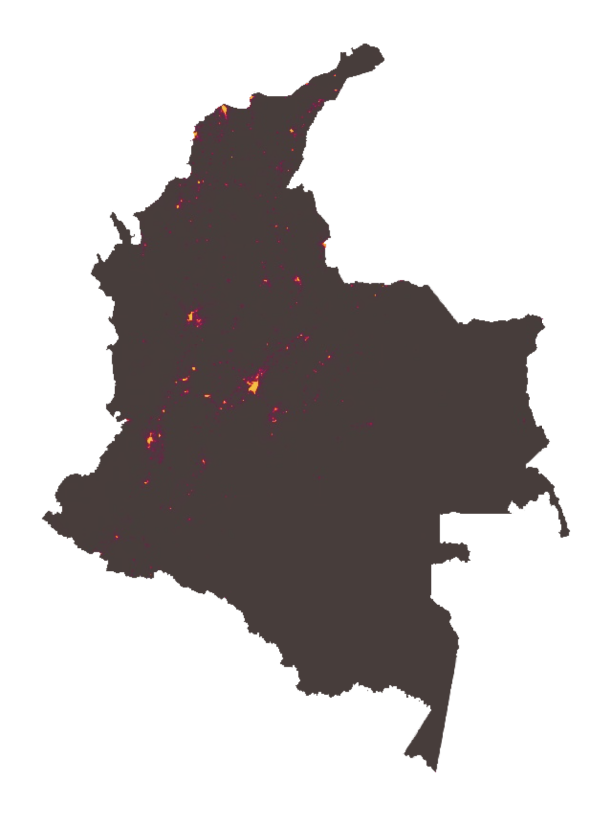

# Night-time reflectance in Colombia

<table border="0">
  <tr>
    <td>
      
    </td>
    <td style="padding-left:20px;">
      <p>This repository contains the code and data used for the analysis of night-time reflectance in Colombia. The analysis was performed using <a href="https://earthengine.google.com/">Google Earth Engine</a> (GEE) and Python.</p>
      <p>In order to reproduce the results, you will need to have access to a Google Earth Engine service account and your own API key. See the <a href="#prerequisites">prerequisites</a>.</p>
      <p><strong>Before using the data, read <a href="#known-issues-and-caveats">Known issues and caveats</a></strong>. It explains the jump between 2016 and 2017 and the negative values.</p>
    </td>
  </tr>
</table>

The repository is structured as follows:

```bash
├── earthengineapikey.json (private)
├── pyproject.toml / uv.lock      # Python environment (uv)
├── requirements.txt              # original environment (pip)
├── LICENSE
├── README.md
├── data/
│   ├── inputs/
│   │   └── municipios_sel.csv
│   └── outputs/
│       ├── areaskm2_municipios.csv
│       ├── cabeceras_stats_clean_2.csv
│       ├── mun_nocabeceras_stats_clean_2.csv
│       └── mun_stats_clean_2.csv
├── notebooks/
│   ├── 01_investigation_outputs.ipynb   # data-quality investigation (2026)
│   └── figures/
├── viirs_docs/                   # EOG readmes and the Elvidge et al. (2021) paper
└── src/
    ├── ee_viirs/
    │   ├── 1_zonal_stats_cabeceras.py
    │   ├── 1_zonal_stats_mun.py
    │   ├── 1_zonal_stats_no_cabeceras.py
    │   └── 2_data_cleaning.py
    ├── 00_polygon_diff.py
    ├── 01_filtering.py
    ├── 02_asset_upload_gee.py
    └── 03_geom_diff.py
```

## Overview

The main aim of the analysis was to answer the following question:

> **How has the night-time reflectance changed in Colombia between 2019 and 2023 for the selected municipalities?**

Although the question focuses on 2019 and 2023, the delivered data cover **every year from 2016 to 2024**. For each year there are zonal statistics for **698 municipalities**, listed in `data/inputs/municipios_sel.csv`, and each municipality is split into three geographic units:

| Unit                               | Output file                         | Polygon source                                      | ID column    |
| ---------------------------------- | ----------------------------------- | --------------------------------------------------- | ------------ |
| Whole municipality                 | `mun_stats_clean_2.csv`             | DANE MGN 2018, municipal boundaries                 | `mpio_ccnct` |
| Cabecera (main urban area)         | `cabeceras_stats_clean_2.csv`       | DANE MGN 2023 urban zones, `clas_ccdgo = 1`         | `mpio_cdpmp` |
| Rest of the municipality ("rural") | `mun_nocabeceras_stats_clean_2.csv` | Municipality minus cabecera (`src/03_geom_diff.py`) | `mpio_ccnct` |

Both ID columns hold the same 5-digit DANE municipality code: all 698 codes match one-to-one across the three files. The municipality and cabecera were analysed separately because most of a municipality's area is rural. An aggregate over the whole municipality would hide changes in its urban centre.

### Satellite data

| Years     | GEE dataset                                                                                                                     | Producer                                                                 |
| --------- | ------------------------------------------------------------------------------------------------------------------------------- | ------------------------------------------------------------------------ |
| 2016–2021 | [`NOAA/VIIRS/DNB/ANNUAL_V21`](https://developers.google.com/earth-engine/datasets/catalog/NOAA_VIIRS_DNB_ANNUAL_V21) (VNL V2.1) | Earth Observation Group (EOG), Payne Institute, Colorado School of Mines |
| 2022–2024 | [`NOAA/VIIRS/DNB/ANNUAL_V22`](https://developers.google.com/earth-engine/datasets/catalog/NOAA_VIIRS_DNB_ANNUAL_V22) (VNL V2.2) | Earth Observation Group (EOG)                                            |

Two versions were needed because GEE holds V2.1 only up to 2021 and V2.2 only from 2022 at the time of extraction.

Both datasets are annual composites of the VIIRS Day/Night Band on the Suomi-NPP satellite, at 15 arc-seconds (~464 m). Radiance is in **nW/cm²/sr**.

## Method

1. **Data preparation**: vector polygon boundaries were simplified with a 10 m tolerance (Ramer–Douglas–Peucker, preserving topology) to reduce file size and improve performance. For the rural units, polygon fragments smaller than 60,000 m² left over after subtracting the cabecera were dropped (`src/03_geom_diff.py`).
1. **Importing data**: the polygons for municipalities, cabeceras and municipalities without cabeceras were imported into GEE as assets.
1. **Zonal statistics**: calculated with the scripts in `src/ee_viirs/` (prefix `1_zonal_stats_`), using `reduceRegions` at `scale=480` m on every annual image. For each of the 8 bands the reducers were **mean, min, max and standard deviation** over the pixels inside each polygon.
1. **Data cleaning**: `src/ee_viirs/2_data_cleaning.py` keeps the statistic columns, adds a `year` column and writes the `*_stats_clean_2.csv` files to `data/outputs/`.

## Output data dictionary

Each `*_stats_clean_2.csv` has one row per unit and year (698 × 9 = 6,282 rows). The statistic columns are named `<band>_<statistic>`, for example `average_masked_mean`.

| Band                       | Meaning                                                                                                 |
| -------------------------- | ------------------------------------------------------------------------------------------------------- |
| `average`                  | Annual average radiance, **unmasked**: includes background (unlit land) noise                           |
| `average_masked`           | Annual average radiance with **background set to 0**: only grid cells judged to be lit keep their value |
| `median` / `median_masked` | Same as above, using the median of the twelve monthly values                                            |
| `minimum` / `maximum`      | Minimum / maximum of the monthly values                                                                 |
| `cf_cvg`                   | Number of cloud-free observations per pixel in the year                                                 |
| `cvg`                      | Number of observations free of sunlight and moonlight per pixel in the year                             |

Other columns: `year`, `shape_area` (polygon area in square degrees; municipality and cabecera files only) and `clas_ccdgo` (cabecera file only, always `1`).

`areaskm2_municipios.csv` gives the area in km² of each unit per municipality: `areakm2_mun`, `areakm2_cab` and `areakm2_munNoCab`.

## Known issues and caveats

These were identified in a data-quality review in September 2026. The full analysis is in `notebooks/01_investigation_outputs.ipynb`. **The delivered data have not been modified.** The points below explain how to read them.

### 1. Calibration change at the end of 2016: the 2016→2017 jump

Until the end of 2016, NOAA estimated the VIIRS Day/Night Band's _dark offset_ (its zero point) from new-moon observations over the Pacific Ocean. Faint natural light from the upper atmosphere (airglow) made that offset too high, so radiances came out too low, especially in dim areas, and sometimes negative. From 2017 NOAA used an airglow-free offset (Uprety et al., 2019; see [Sources](#sources)). The EOG annual products for 2013–2016 still carry the old calibration.

**2016 is the only year in this dataset from before the change.** In the unmasked `average` band, this appears as an almost uniform jump of about **+0.2 nW/cm²/sr** from 2016 to 2017 in 99 % of municipalities, whether dark or bright. It is not a real change in lighting. Checks on never-lit pixels confirm that the step is global:

| Median `average` of never-lit pixels | 2014  | 2015  | 2016  | 2017 | 2020 | 2024 |
| ------------------------------------ | ----- | ----- | ----- | ---- | ---- | ---- |
| Colombia, Amazon                     | −0.03 | 0.01  | 0.02  | 0.15 | 0.25 | 0.33 |
| Colombia, Llanos (Vichada)           | −0.02 | 0.05  | −0.02 | 0.15 | 0.25 | 0.30 |
| Sahara (control)                     | 0.07  | 0.08  | 0.04  | 0.24 | 0.28 | 0.37 |
| Inland Australia (control)           | −0.02 | −0.04 | −0.02 | 0.18 | 0.21 | 0.27 |

### 2. Background drift after 2017

After the calibration change, the unmasked background of unlit land stays **above zero and rises over time**, from about 0.15 in 2017 to about 0.3 in 2024, with smaller steps in 2019→2020 and 2022→2023. Changes over time in the unmasked `average` band therefore include this drift, which is largest relative to the value in dim, rural units.

### 3. Negative values

- **No `average_masked_mean` value is negative.**
- 61 unit-years have a negative `average_mean` (or `median_mean`). 56 of them are in 2016, and all are tiny (−0.03 to 0). They are caused by the pre-2017 calibration (issue 1).
- Many `_min` values are negative. A negative minimum only means that at least one pixel in the polygon is below zero.

### 4. The −1.5 placeholder

EOG uses **−1.5** as a placeholder for grid cells where no annual median could be computed. It is a flag, not a measurement: over Colombia, no pixel has a value below −1.5 or between −1.5 and −1.0. In these cells the `average` and `median` bands both hold −1.5. When the flag appears depends on the version (see the readmes in `viirs_docs/`):

- **V2.1 (2016–2021)**: the median skips any month with fewer than 3 cloud-free observations. A cell in a persistently cloudy area can have up to about 23 cloud-free observations in the year, spread as 1–2 per month, and still end up with no valid month.
- **V2.2 (2022–2024)**: only cells with no cloud-free observation at all in the year are flagged.

These cells are rare: between 14 and about 4,100 of Colombia's 5.3 million pixels per year, except about 44,600 (0.8 %) in 2021, the cloudiest year. GEE does not mask the flag, so it enters the zonal statistics as if it were a radiance. A single flagged pixel is enough to make a polygon's `average_min` equal −1.5, which happens in up to 120 municipalities in a year. The effect on polygon **means** is small, but minimum values of exactly −1.5 should be read as "no data".

### 5. V2.1 vs V2.2

V2.2 (2022 onward) adds NOAA-20 observations to Suomi-NPP in 2022 and accepts months with at least 1 cloud-free coverage, where V2.1 required 3. It also handles grid cells without a median value differently (see the readmes in `viirs_docs/`). This is why `cvg` jumps in 2022 (median 184 → 229). The 2021→2022 change in radiance is within normal year-to-year variation. The switch between versions is **not** a source of discontinuity in these data.

### 6. Other notes

- **Cloud cover**: Colombia is cloudy. Median `cf_cvg` falls from about 50 (2016–2019) to about 33–36 (2021, 2023), so those years rest on fewer nights and are noisier.
- **Boundary years**: municipalities and rural units use MGN 2018 boundaries; cabeceras use MGN 2023 urban zones.
- **Consistency**: area-weighted cabecera and rural values recompose the municipality value to within ±0.3 % (5th–95th percentile).

## Prerequisites

**A Google Earth Engine account**.

- The `geemap` and `earthengine-api` Python packages. Install the environment with `uv sync` (`pyproject.toml`), or with `pip install -r requirements.txt` for the original environment.
- A Google Earth Engine service account key file (`earthengineapikey.json`).

Note: the original GEE project (`small-towns-col`) and its polygon assets no longer exist. To re-run the extraction, the polygons need to be rebuilt and uploaded again.

### Environment Variable

The following environment variable must be set:

- `EE_SERVICE_ACCOUNT`: Your Google Earth Engine service account email address.
  You can create this string and set the environment variable by adding the following lines to your `.zshrc` or `.bashrc` file:

      ```bash
      export EE_SERVICE_ACCOUNT="your_service_account@example.iam.gserviceaccount.com"
      ```

      _(Replace the example values with your actual credentials and file path.)_

## Sources

- **VIIRS Nighttime Day/Night Annual Band Composites V2.1 and V2.2**: GEE catalog [V2.1](https://developers.google.com/earth-engine/datasets/catalog/NOAA_VIIRS_DNB_ANNUAL_V21) and [V2.2](https://developers.google.com/earth-engine/datasets/catalog/NOAA_VIIRS_DNB_ANNUAL_V22); [EOG VIIRS Nighttime Light products](https://eogdata.mines.edu/products/vnl/).
  - Elvidge, C.D., Zhizhin, M., Ghosh, T., Hsu, F.C., Taneja, J. Annual time series of global VIIRS nighttime lights derived from monthly averages: 2012 to 2019. _Remote Sensing_ 2021, 13(5), 922. [doi:10.3390/rs13050922](https://doi.org/10.3390/rs13050922). Copy in `viirs_docs/`.
- **Calibration change at the end of 2016 (dark offset / airglow)**:
  - Uprety, S., Cao, C., Gu, Y., Shao, X., Blonski, S., Zhang, B. Calibration Improvements in S-NPP VIIRS DNB Sensor Data Record (SDR) using Version 2 Reprocessing. NOAA Center for Satellite Applications and Research (STAR), manuscript, 2019. NOAA Institutional Repository: [repository.library.noaa.gov/view/noaa/65852](https://repository.library.noaa.gov/view/noaa/65852).
- **Colombia Municipal Boundaries**: DANE Marco Geoestadístico Nacional 2018 (municipalities) and 2023 (urban zones). [link](https://www.dane.gov.co/files/geoportal-provisional/)

## Maps

Final maps generated for this project are a complementary product of the analysis.

The maps were generated using the following GEE scripts:

- [Radiance and Difference Maps](https://code.earthengine.google.com/ea0f6c7f2d7f33db17ab848f70100bc0)

Stored in the following folder: [Night-time Reflectance Maps](https://drive.google.com/drive/u/0/folders/1AkOKXE3mWNld7PRq9rW18ZxmHjDH-0kA)

### App

The following **MVP** app provides an interactive interface to visualize the night-time reflectance of the selected municipalities in Antioquia.

- [GEE APP](https://gregmaya.users.earthengine.app/view/nightime-brightness)
